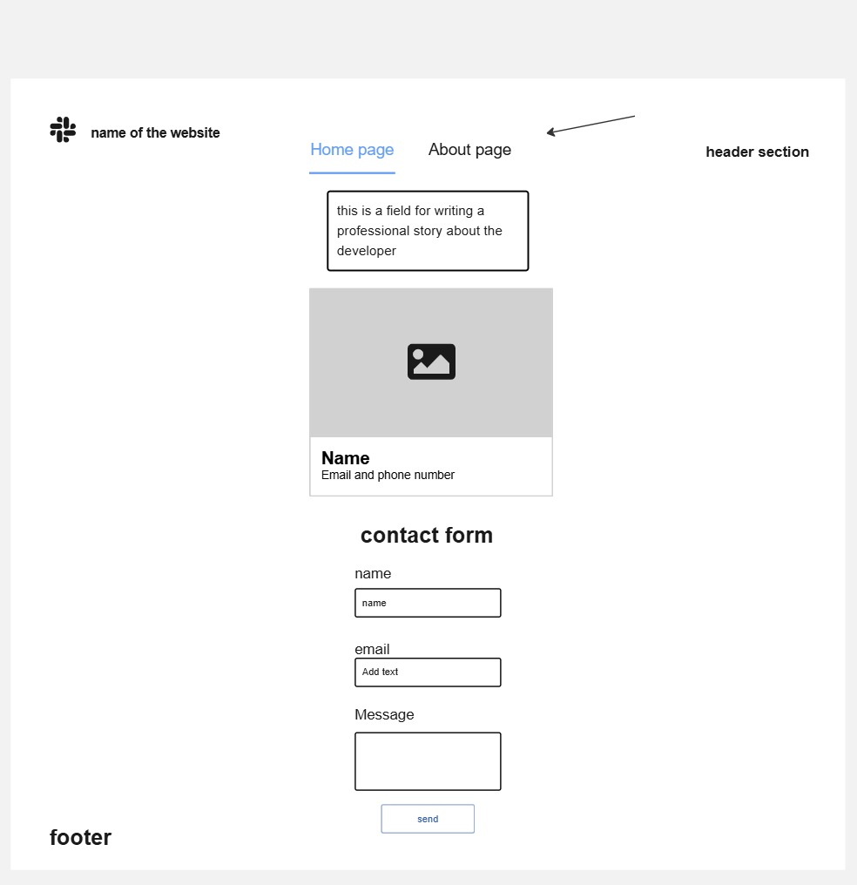

# My-Tasks

* drawing a wireframes for the website we are making:

    By the way a wireframe helps us to visualize or imagine the website before starting to implement it with the code.

 - let's start first with the Home page

    

    **Header section**

    this Home page that you see contains a header section which includes the logo and a navigation little bar in the middle that let's the user jump between the home page and the about page.
    **task input section**

    then we have a task input section which the user can enter his tasks in the box and click add task.

    **tasks tracking section**

    then we have a task tracking section so the user can track his submitted tasks, so every tasks he submits it appears in this tracking section and inside every task he adds we have a button that shows the status of the task if it's completed or not completed.

    **Footer section**

    lastly, we have the footer section which will include the copyright information

 ______________________________________________________

 - **About page**

 

  Now we have the about page, actually the about page contains: 

   - header section to show the logo and the name and the navigation bar that let's you jump between the home page and the about page

   - a personal section which gives a professional paragraph about the person who we are introducing

   - and above that personal section on the right side we have a personal card or a form that shows a picture of that person and his name above, and also the email and phone number.

   - and we have a contact form section which allows the user to enter his name and email and the message he wants to send a message to that person.

   - lastly we have a footer section that will contain a copyright information and a short message.

   

